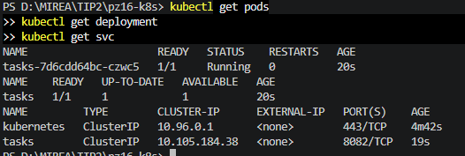
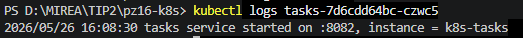
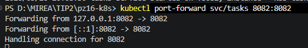
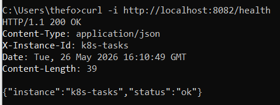
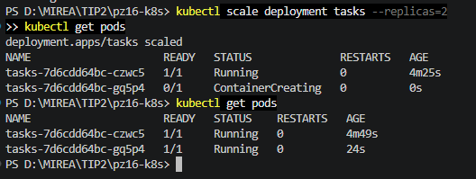

# Практическое занятие №16
# Публикация приложения в Kubernetes (минимальный манифест)

**Дисциплина:** Технологии индустриального программирования  
**Семестр:** 2, 2025-2026  
**Студент:** Синицын А.Г. ЭФМО-01-25

---

## Краткое описание проекта

Сервис `tasks` (из практики №10) контейнеризирован и развёрнут в Kubernetes.  
Использованы манифесты: ConfigMap (конфигурация), Deployment (управление подами), Service (доступ внутри кластера).  
Настроены readiness и liveness probes (проверка `/health`). Доступ к сервису продемонстрирован через `kubectl port-forward`.

---

## Структура проекта

```
pz16-k8s/
├── services/
│   └── tasks/
│       ├── cmd/server/
│       ├── Dockerfile
│       └── go.mod
├── deploy/
│   └── k8s/
│       ├── configmap.yaml
│       ├── deployment.yaml
│       └── service.yaml
└── README.md
```

---

## Требования к проекту

- Docker
- Kubernetes (minikube / kind / k3s)
- kubectl

---

## Сборка Docker-образа

```
cd services/tasks
docker build -t techip-tasks:0.1 .
```

Загрузка образа в minikube:
```
minikube image load techip-tasks:0.1
```

---

## Применение манифестов

```
kubectl apply -f deploy/k8s/configmap.yaml
kubectl apply -f deploy/k8s/deployment.yaml
kubectl apply -f deploy/k8s/service.yaml
```

---

## Результаты выполнения (скриншоты)

### 1. Состояние Pod


### 2. Логи приложения


### 3. Доступ через port-forward



### 4. Health endpoint


### 5. Масштабирование до 2 реплик


---

## Ответы на контрольные вопросы (строго по теории из файла)

**1. Что такое Kubernetes и для чего он используется?**  
Kubernetes — это система оркестрации контейнеров, предназначенная для запуска, масштабирования и сопровождения приложений в контейнерах. Решает задачи: запуск контейнеров, поддержание нужного числа экземпляров, перезапуск при сбое, отделение конфигурации от образа, масштабирование и единый способ публикации сервисов.

**2. Чем Pod отличается от Deployment?**  
Pod — минимальная единица развертывания в Kubernetes, содержит один или несколько контейнеров. Deployment — объект, описывающий, сколько экземпляров приложения должно работать и как они должны запускаться, управляет подами (создаёт, перезапускает, масштабирует).

**3. Почему приложение в Kubernetes обычно публикуют через Deployment, а не через одиночный Pod?**  
Если Pod будет удалён или завершится аварийно, его нужно создавать заново вручную. Deployment автоматически восстанавливает нужное количество Pod, обеспечивает отказоустойчивость и декларативное управление.

**4. Зачем нужен Service и почему нельзя строить обращение к приложению напрямую через Pod?**  
Pod не является стабильной точкой доступа: его имя, IP-адрес и жизненный цикл могут меняться. Service предоставляет стабильную точку входа и направляет запросы к нужным Pod.

**5. Что такое ConfigMap?**  
ConfigMap — объект Kubernetes для хранения несекретной конфигурации приложения (порт, адрес другого сервиса, уровень логирования). Позволяет не встраивать конфигурацию в образ.

**6. Чем ConfigMap отличается от Secret?**  
Secret хранит конфиденциальную информацию (пароли, токены, ключи) в закодированном виде. ConfigMap — для обычной текстовой конфигурации.

**7. Для чего используется readiness probe?**  
Readiness probe проверяет, готово ли приложение принимать запросы. Пока проверка не успешна, Kubernetes не направляет трафик на Pod через Service.

**8. Для чего используется liveness probe?**  
Liveness probe проверяет, что приложение не зависло и работает корректно. Если проверка стабильно проваливается, Kubernetes перезапускает контейнер.

**9. Почему важно использовать фиксированный тег образа, а не только latest?**  
Фиксированный тег позволяет точно знать, какая версия приложения запущена, воспроизводить развёртывание, легче искать ошибки и делать управляемые обновления.

**10. Зачем нужен kubectl port-forward?**  
Для временного доступа к приложению извне кластера (без публикации Service наружу). Позволяет локально проверить работу сервиса.

**11. Что делает команда kubectl scale deployment ...?**  
Изменяет количество реплик (экземпляров) приложения в Deployment. Например, `kubectl scale deployment tasks --replicas=2` увеличивает число Pod до двух.

**12. Почему публикация приложения в Kubernetes считается декларативной?**  
Пользователь описывает желаемое состояние (YAML-манифесты), а Kubernetes сам приводит систему к этому состоянию, автоматически создавая, удаляя или пересоздавая ресурсы.
